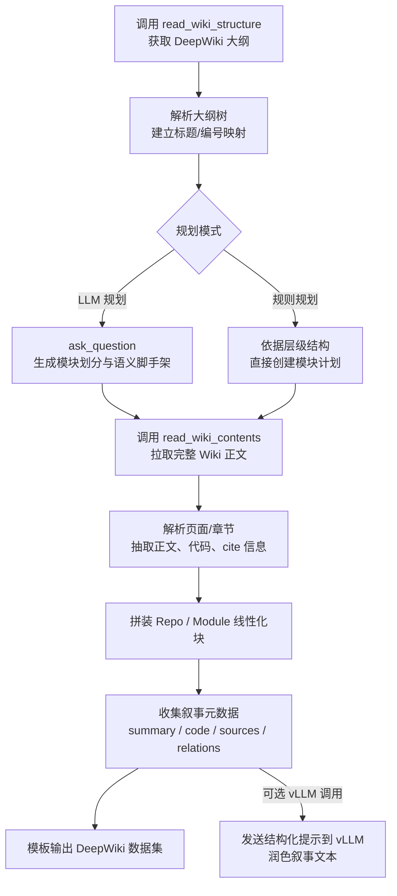

# DeepWiki Semantic Scaffold Pipeline
## 流程概览（中文）



**要点**

- `deepwiki_mcp_client.py`（LLM 规划版）与 `deepwiki_rule_pipeline.py`（规则版）共享相同的叙事与输出接口，差异仅在模块计划的生成方式。
- 每个模块在拼装时都会生成 `NarrativeDatum`，包含摘要、代码片段、引用来源等。如果正文只有 `<cite>` 引用，会自动从 GitHub raw 文件抓取对应行填充代码块。
- 叙事文本默认由模板生成，可通过 `--narrative-use-vllm` 将这些结构化信息发送到自定义 vLLM 服务，获得更自然的英文描述；失败时自动回退到模板文本。
- 输出分为两类：
  - 线性化 DeepWiki 数据（受 `--output` 和 `--output-format` 控制），遵循 `[Repository Overview]` 与 `[Module Group]` 模板。
  - 叙事文本（受 `--narrative-*` 控制），支持多种模式：`code`、`structure`、`comment`、`cross`、`all`。

### 快速命令示例（中文）

**LLM 规划版（含 vLLM 润色）：**

```bash
python deepwiki_mcp_client.py \
  --generate-dataset volcengine/verl \
  --repo-commit "809ae5" \
  --output-format text \
  --output result_data/verl_deepwiki.txt \
  --narrative-modes code cross \
  --narrative-format json \
  --narrative-output result_data/verl_narratives.json \
  --log-level INFO \
  --design-use-vllm \
  --design-vllm-model gpt-oss-20b \
  --design-vllm-server-url http://[fdbd:dccd:cdd2:2101::220]:8000/v1/chat/completions

```


**规则规划版（仅模板叙事）：**

```bash
python deepwiki_rule_pipeline.py \
  NVIDIA/Megatron-LM \
  --output-format text \
  --output result_data/megatron_rule.txt \
  --narrative-modes structure \
  --narrative-output result_data/megatron_rule_narratives.txt
```

根据需要调整输出路径、叙事模式及 vLLM 相关参数。

This document explains how to synthesize DeepWiki-style pretraining data with the
extended MCP client (`deepwiki_mcp_client.py`). The pipeline combines the
DeepWiki MCP tools with an LLM-assisted planning stage to generate structured
linearized corpora that capture repository semantics beyond raw code tokens.

## Overview

The LLM-assisted pipeline (`deepwiki_mcp_client.py`) runs five major stages:

1. **Outline Harvesting** – Calls the `read_wiki_structure` MCP tool to collect
   the DeepWiki page outline for a target repository.
2. **Semantic Planning** – Derives a deterministic, tutorial-style set of
   stages (5–8 by default) directly from the outline. Each stage captures
   learner goals, prerequisites, dependencies, and the wiki sections that will
   be pulled in subsequent steps. No MCP `ask_question` call is required.
3. **Content Retrieval** – Downloads the full wiki content via
   `read_wiki_contents`, then parses the markdown into page/section objects.
4. **Scaffold Assembly** – For each module group, the pipeline injects the
   semantic scaffold (responsibility, design rationale, architecture role)
   followed by the referenced wiki sections, producing a linearized chunk per
   module plus a repository-level overview chunk.
5. **Narrative Harvesting (optional)** – As each section is processed, metadata
   (summary sentence, first code block, file references, inferred relations) is
   captured for downstream narrative templates.
6. **Design Intent Rewriting (optional)** – Pass `--design-use-vllm` to rewrite
   each section’s design intent via a configurable vLLM endpoint. Referenced
   source links (e.g. `[path.py:34-70]()`) are replaced inline with the
   corresponding code snippets pulled directly from the repository. The pipeline
   falls back to the original summary if the external rewrite is unavailable.

### Repository provenance

- Use `--repo-root /path/to/clone` to read source snippets from a local checkout
  (useful when working offline or pinning to a specific workspace).
- Use `--repo-commit <sha>` to fetch raw files from a fixed revision on GitHub.
  When omitted, the pipeline defaults to the `main`/`master` branches.

The result is a set of high-cohesion, low-coupling chunks that adhere to the
DeepWiki formatting template, plus optional narrative views built from the same
metadata.

## Pipeline Variants

- **LLM Semantic Planner** (`deepwiki_mcp_client.py`) – Uses DeepWiki's LLM to
  regroup outline sections into cohesive module clusters before retrieving
  content. Suitable when an adaptive semantic scaffold is desired.
- **Rule-Based Planner** (`deepwiki_rule_pipeline.py`) – Derives module groups
  directly from the outline hierarchy, preserving the original structure. Use
  this for deterministic runs or when LLM access is unavailable.

Both variants share the same narrative extraction layer and CLI surface.

## Requirements

- Python 3.10+
- `requests` (already used by the MCP client)
- Network access to `https://mcp.deepwiki.com/mcp`

## Quick Start

```bash
# Inspect available tools
python deepwiki_mcp_client.py --list-tools

# Generate a DeepWiki dataset for a repository
python deepwiki_mcp_client.py \
  --generate-dataset vercel/next.js \
  --output-format text \
  --output /tmp/nextjs_deepwiki.txt

# Emit JSON instead of plain text
python deepwiki_mcp_client.py \
  --generate-dataset vercel/next.js \
  --output-format json

# Run the deterministic rule-based variant
python deepwiki_rule_pipeline.py vercel/next.js --output-format text
```

Flags:

- `--output-format text|json` controls serialization. The JSON output includes
  labels and chunk text, while the text output concatenates all chunks in the
  linearization order.
- `--output <path>` writes results to disk; omit to stream to stdout.
- `--narrative-modes` requests one or more narrative templates (`code`,
  `structure`, `comment`, `cross`, or `all`).
- `--narrative-format text|json` and `--narrative-output <path>` mirror the data
  options for narrative exports.
- `--narrative-use-vllm` enables rewriting narratives with an external vLLM
  server; pair with the `--narrative-vllm-*` flags to specify endpoint and
  sampling parameters.

Existing flags (`--ask-question`, `--read-structure`, `--read-contents`) still
behave as before and are useful for debugging intermediate stages.

The `deepwiki_rule_pipeline.py` script exposes the same output and narrative
options (including `--narrative-use-vllm`) but avoids LLM planning. It derives
module groupings directly from the wiki outline, making it suitable for fully
deterministic data builds or environments without DeepWiki's planning LLM.

## Narrative Modes

Both pipelines can emit narrative scaffolds derived from the same module
metadata. Example:

```bash
python deepwiki_mcp_client.py \
  --generate-dataset vercel/next.js \
  --output-format text \
  --output /tmp/next_deepwiki.txt \
  --narrative-modes code cross \
  --narrative-format json \
  --narrative-output /tmp/next_narratives.json
```

Available modes:

- `code` – code-centric narrative of the component.
- `structure` – structural walkthrough tying interfaces together.
- `comment` – inline comment expansion using extracted code blocks.
- `cross` – cross-file stitching highlighting definitions vs usage.
- `all` – expands into every mode above.

### LLM-enhanced narratives

To polish template narratives with a custom vLLM deployment:

```bash
python deepwiki_mcp_client.py \
  --generate-dataset NVIDIA/Megatron-LM \
  --output-format text \
  --output result_data/megatron_deepwiki.txt \
  --narrative-modes code cross \
  --narrative-use-vllm \
  --narrative-vllm-model my-chat-model \
  --narrative-vllm-server-url http://localhost:8000/v1/chat/completions \
  --narrative-format json \
  --narrative-output result_data/megatron_narratives.json
```

The pipeline will feed structured metadata (summary, code snippet, source
citations) to the vLLM server and replace the template prose with the model's
response. If no code is present in the wiki, the system tries to resolve the
first `<cite>` reference and fetch the corresponding raw GitHub snippet so the
LLM can still ground its explanation.

## Output Structure

Each dataset run emits a `PipelineOutput` consisting of:

- **Repo Overview Chunk** – Contains `[Repository Overview]`,
  `[Architecture Summary]`, and `[Dependency Explanation]` sections synthesised
  by the planner.
- **Module Chunks** – For each planned module group:
  - `[Module Group <n>]` header
  - `[Module: <name>]` scaffold with responsibility, design assumptions, role,
    external dependencies, and optional ordering hints
  - `[Implementation Files in Topo Order]` containing the referenced wiki
    sections in topological order
- **Narrative Metadata** – A list of per-section dictionaries capturing summary
  text, first code block, inferred file references, and relation hints.

Chunk labels follow the pattern `repo-overview` and `module:<slug>`.

When wiki正文只包含 `<cite ...>` 引用而没有内嵌代码时，管线会解析引用的仓库路径并尝试从 GitHub 的 `raw` 内容中抓取对应的行片段，用作叙事模板中的代码块，同时记录 `sources` 列表以便追踪出处。

## Planner Robustness

The planning stage may occasionally produce invalid JSON or reference missing
sections. The client implements guardrails to improve stability:

- Retries `ask_question` if JSON parsing fails (captures the partial payload on
  repeated failure).
- Re-requests the plan when a module omits section references.
- Applies fuzzy matching to resolve minor mismatches between section titles in
  the plan and actual wiki headings.

If these safeguards are insufficient, the command exits with an explanatory
`MCPError` message. Re-running usually succeeds, as the LLM will generate a new
plan.

## Extending the Pipeline

- **Caching** – Wrap `_fetch_structure_text` / `_fetch_contents_markdown` to
  persist responses for repeated runs on the same repo.
- **Custom Prompts** – Modify `_request_semantic_plan` to steer module grouping
  or introduce additional scaffold fields.
- **Chunk Post-processing** – Process `PipelineOutput` before serialization to
  inject repo-specific metadata or split chunks for downstream packing.

## Troubleshooting

- `ask_question response was not valid JSON` – Inspect the printed partial
  payload to see the malformed span, then retry (the client already makes
  multiple attempts).
- `Module '<name>' could not resolve section '<section>'` – The fuzzy matcher
  could not find a close heading. Check the wiki page to confirm the section
  exists, then rerun.
- Connection issues – Ensure outbound HTTPS access to `mcp.deepwiki.com` and
  verify no proxy is blocking SSE streaming.

## Example

Sample output for `vercel/next.js` is in `/tmp/nextjs_dataset.txt` (generated
via `--output-format text`). The JSON equivalent contains the same data with
explicit chunk labels.
